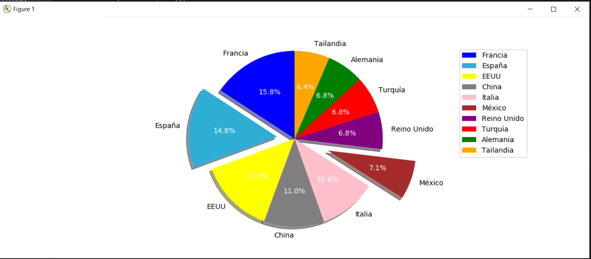
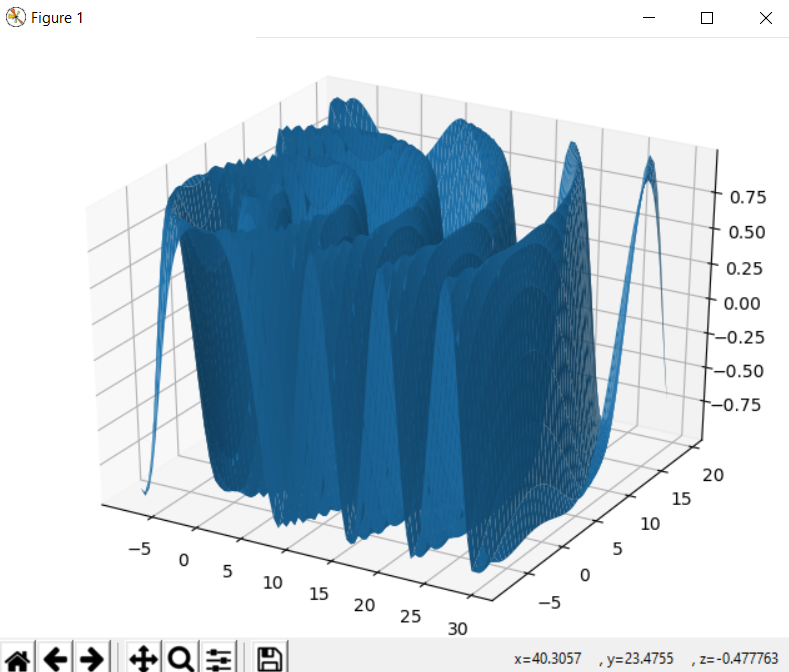

# *Gráficas con python y matplotlib*.

Exite una gran variedad de módulos para hacer gráficos de todo tipo con Python, pero el estándar de facto en ciencia es matplotlib. Se trata de un paquete grande y relativamente complejo que entre otros contiene dos módulos principales, **pyplot** y **pylab**.

### **Pyplot:**

**Pyplot** ofrece una interfaz fácil para crear gráficos fácilmente, automatizando la creación de figuras y ejes automáticamente cuando hace un gráfico.

### **Pylab:**
 **Pylab** combina la funcionalida de **pyplot** para hacer gráficos con funcionalidad de **numpy** para hacer cálculos con arrays usando un único espacio de nombres.

 ## *__Instalacion de librerías.__*
 Para instalar matplotlib solo tenemos que ejecutar **pip install matplotlib.**

 ## *__Gráficos de líneas__*

Para dar claridad a los gráficos pueden establecerse distintos estilos de líneas, marcadores y colores:

__Estilos de Líneas (linestyle=):__
* -, Línea Sólida
* --, Línea discontinua
* :, Línea punteada
* -., Línea punteada discontinua. 
* None, Ninguna línea

__Marcadores (marker=):__
* +, Cruz
* ., Punto
* o,Círculo
* *, Estrellas
* p, Pentágonos
* s, cuadrados
* x, Tachados
* D, Diamantes
* h, Hexágonos y
* ^, Triángulos

__Colores (color=):__
* b, blue
* g, green
* r, red
* c, cyan
* m, magenta
* y, yellow
* k, black
* w, white

 ## *__Gráficos de barras__*

 

 ## *__Gráficos de tipo tarta__*

 

Si sustituimos plot(y) por pie(y)  generamos un gráfico de tipo tarta. 

 ## *__Gráficos de 3D__*
Con el siguiente código generamos un gráfico en 3D con los datos facilitados en X e Y, el eje X se facilita en el primer parámetro de numpy.arange:

 

